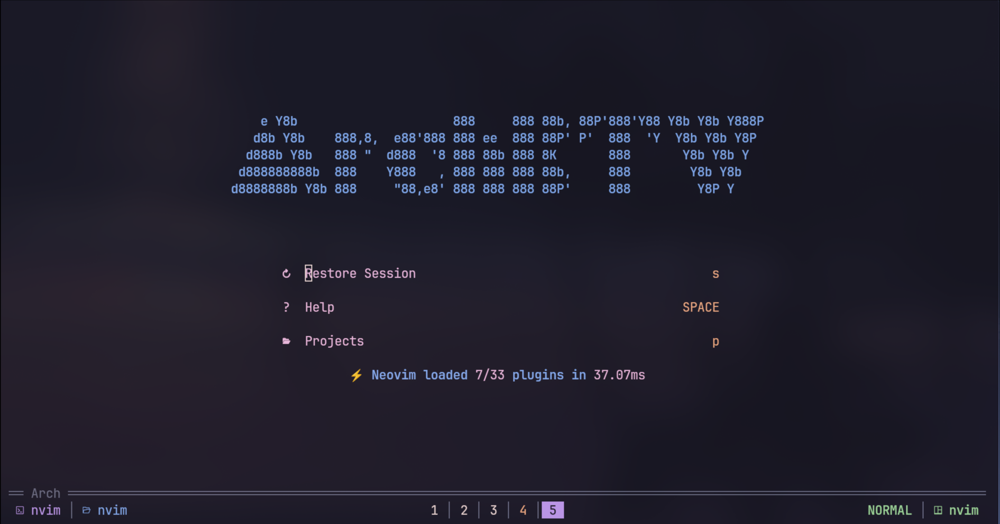

# Neovim Config

|     |   |
| -------------------- | ------------------------ |
|  |  |

# Keybindings for Nvim

---

### **Neovim Keybindings Overview**

| Category                    | Keybinding            | Action                        | Rating             |     |
| --------------------------- | --------------------- | ----------------------------- | ------------------ | --- |
| **Navigation**              | Alt + j               | Move Down                     | —                  |     |
|                             | Alt + k               | Move Up                       | —                  |     |
|                             | Shift + H             | Move to previous Tab / Buffer | —                  |     |
|                             | Shift + L             | Move to next Tab / Buffer     | —                  |     |
|                             | `[b`                  | Next Tab                      | —                  |     |
|                             | `]b`                  | Previous Tab                  | —                  |     |
| **Buffer / Tab Management** | `<leader>bD`          | Close Tab / Buffer            | —                  |     |
|                             | `<leader>bp`          | Pin the Buffer                | —                  |     |
| **Search & Results Nav**    | n                     | Next Result                   | —                  |     |
|                             | N                     | Previous Result               | —                  |     |
|                             | `[[`                  | Next References               | Preferred          |     |
|                             | `]]`                  | Previous References           | Preferred          |     |
|                             | Alt + N               | Next References               | Preferred          |     |
|                             | Alt + P               | Previous References           | Preferred          |     |
| **File Operations**         | Ctrl + S              | Save the file                 | —                  |     |
|                             | `<leader>fn`          | New File                      | —                  |     |
| **Line Numbers & UI**       | `<leader>uL`          | Toggle Relative Number        | —                  |     |
|                             | `<leader>ul`          | Toggle Line Number            | —                  |     |
|                             | `<leader>uD`          | Toggle Dimming                | Preferred          |     |
|                             | `<leader>uh`          | Toggle Inlay Hints            | —                  |     |
|                             | `<leader>uz`          | Toggle Zen Mode               | Preferred          |     |
| **Session Management**      | `<leader>ql`          | Restore Session               | Preferred          |     |
|                             | `<leader>qd`          | Don't save current Session    | Preferred          |     |
| **Quitting**                | `<leader>qq`          | Quit All                      | Preferred          |     |
| **Terminal**                | `<leader>fT`          | Terminal                      | —                  |     |
|                             | `<leader>` + Ctrl + / | Toggle Terminal               | Preferred          |     |
| **Window Management**       | \`<leader>            | \`                            | Split Window Right | —   |
|                             | `<leader>wd`          | Kill that window              | —                  |     |
| **LSP**                     | `<leader>gd`          | Go to Definition              | Preferred          |     |
|                             | `<leader>gr`          | References                    | Preferred          |     |
|                             | Shift + K             | Hover                         | Preferred          |     |
| **Comments**                | gcc                   | Toggle Comment                | —                  |     |
| **Search & Replace**        | `<leader>sr`          | Search And Replace            | Preferred          |     |
| **Mason**                   | `<leader>cm`          | Mason                         | Preferred          |     |
| **File Finder / Search**    | `<leader><SPACE>`     | Find Files                    | Preferred          |     |
|                             | `<leader>,`           | Search through Buffers        | Preferred          |     |
|                             | `<leader>/`           | Find Words                    | Preferred          |     |
|                             | `<leader>:`           | Command History               | Preferred          |     |
|                             | `<leader>e`           | File Explorer                 | Preferred          |     |
|                             | `<leader>fp`          | Find Projects                 | Preferred          |     |
|                             | `<leader>fr`          | Recent Files                  | Preferred          |     |
| **Git**                     | `<leader>gd`          | Git Diff                      | Preferred          |     |
|                             | `<leader>gs`          | Git Status                    | Preferred          |     |
| **Notifications & Help**    | `<leader>n`           | Notification History          | —                  |     |
|                             | `<leader>s/`          | Search History                | —                  |     |
|                             | `<leader>sh`          | Help Pages                    | —                  |     |
|                             | `<leader>sH`          | Highlights                    | —                  |     |
|                             | `<leader>si`          | Icons                         | Preferred          |     |
|                             | `<leader>sj`          | Jumps                         | Preferred          |     |
|                             | `<leader>sk`          | All Keymaps                   | Preferred          |     |
|                             | `<leader>sw`          | Visual Selection of Word      | Preferred          |     |

---
