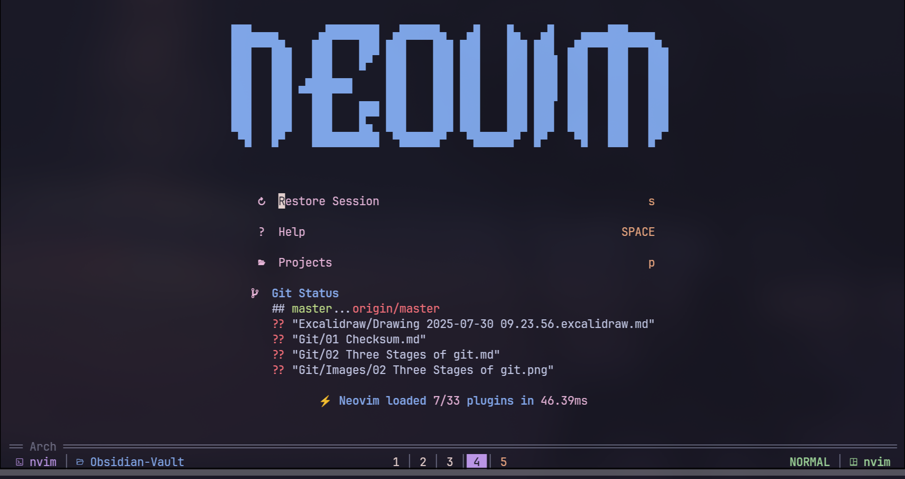
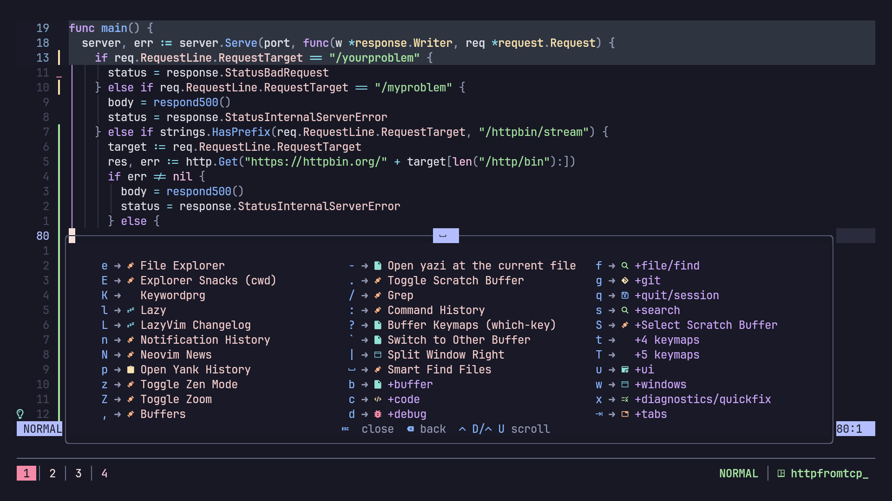

# Neovim Config

- Custom setup built on LazyVim with snacks.nvim for a clean and responsive editing experience.


|     |   |
| -------------------- | ------------------------ |
|  |  |


## Recommended workflow (From Hard Time Nvim)

> Instead of only relying on hjkl, arrow keys and mouse, you should:

- Use relative jump (eg: 5j 12-) for vertical movement within the screen.
- Use CTRL-U CTRL-D CTRL-B CTRL-F gg G for vertical movement outside the screen.
- Use word-motion (w W b B e E ge gE) for short-distance horizontal movement.
- Use f F t T , ; 0 ^ $ for medium to long-distance horizontal movement.
- Use operator + motion/text-object (eg: ci{ y5j dap) whenever possible.
- Use % and square bracket commands (see :h [) to jump between brackets.

---

### Vim Motions Cheat Sheet (Words, Quotes, and Brackets)

* **Changing or deleting words**

  * `ciw` – Change *inner word* (removes the word under cursor and enters Insert mode).
  * `caw` – Change *a word* (word + trailing space) and enter Insert mode.

* **Selecting text inside delimiters**

  * `vi"` – Visual select everything *inside* quotes `" "`.
  * `vib` – Visual select everything *inside* parentheses `( )` or brackets `[ ]`.

* **Inserting at specific positions**

  * `Shift + A` (`A`) – Append text at the *end of the line*.
  * `Shift + I` (`I`) – Insert text at the *start of the line*.

---

### Motion Format

In Vim, many commands follow this consistent pattern:

```
<operator> + <a/i> + <text object>
```

* **Operator examples:**

  * `c` – change
  * `d` – delete
  * `y` – yank
  * `v` – visually select

* **Scope:**

  * `i` – *inner* (inside only)
  * `a` – *around* (including delimiters)

* **Text objects:**

  * `w` – word
  * `"` – quotes
  * `b` – brackets or parentheses
  * `)` – parentheses specifically
  * `}` – braces

**Examples:**

* `ci"` – change *inside quotes*
* `va(` – visually select *around parentheses*
* `di}` – delete *inside braces*

---


## **Neovim Keybindings Overview**


| Category                    | Keybinding            | Action                        | Rating             |     |
| --------------------------- | --------------------- | ----------------------------- | ------------------ | --- |
| **Navigation**              | Alt + j               | Move Down                     | —                  |     |
|                             | Alt + k               | Move Up                       | —                  |     |
|                             | Shift + H             | Move to previous Tab / Buffer | —                  |     |
|                             | Shift + L             | Move to next Tab / Buffer     | —                  |     |
|                             | `[b`                  | Next Tab                      | —                  |     |
|                             | `]b`                  | Previous Tab                  | —                  |     |
| **Buffer / Tab Management** | `<leader>bD`          | Close Tab / Buffer            | —                  |     |
|                             | `<leader>bp`          | Pin the Buffer                | —                  |     |
| **Search & Results Nav**    | n                     | Next Result                   | —                  |     |
|                             | N                     | Previous Result               | —                  |     |
|                             | `[[`                  | Next References               | Preferred          |     |
|                             | `]]`                  | Previous References           | Preferred          |     |
|                             | Alt + N               | Next References               | Preferred          |     |
|                             | Alt + P               | Previous References           | Preferred          |     |
| **File Operations**         | Ctrl + S              | Save the file                 | —                  |     |
|                             | `<leader>fn`          | New File                      | —                  |     |
| **Line Numbers & UI**       | `<leader>uL`          | Toggle Relative Number        | —                  |     |
|                             | `<leader>ul`          | Toggle Line Number            | —                  |     |
|                             | `<leader>uD`          | Toggle Dimming                | Preferred          |     |
|                             | `<leader>uh`          | Toggle Inlay Hints            | —                  |     |
|                             | `<leader>uz`          | Toggle Zen Mode               | Preferred          |     |
| **Session Management**      | `<leader>ql`          | Restore Session               | Preferred          |     |
|                             | `<leader>qd`          | Don't save current Session    | Preferred          |     |
| **Quitting**                | `<leader>qq`          | Quit All                      | Preferred          |     |
| **Terminal**                | `<leader>fT`          | Terminal                      | —                  |     |
|                             | `<leader>` + Ctrl + / | Toggle Terminal               | Preferred          |     |
| **Window Management**       | \`<leader>            | \`                            | Split Window Right | —   |
|                             | `<leader>wd`          | Kill that window              | —                  |     |
| **LSP**                     | `<leader>gd`          | Go to Definition              | Preferred          |     |
|                             | `<leader>gr`          | References                    | Preferred          |     |
|                             | Shift + K             | Hover                         | Preferred          |     |
| **Comments**                | gcc                   | Toggle Comment                | —                  |     |
| **Search & Replace**        | `<leader>sr`          | Search And Replace            | Preferred          |     |
| **Mason**                   | `<leader>cm`          | Mason                         | Preferred          |     |
| **File Finder / Search**    | `<leader><SPACE>`     | Find Files                    | Preferred          |     |
|                             | `<leader>,`           | Search through Buffers        | Preferred          |     |
|                             | `<leader>/`           | Find Words                    | Preferred          |     |
|                             | `<leader>:`           | Command History               | Preferred          |     |
|                             | `<leader>e`           | File Explorer                 | Preferred          |     |
|                             | `<leader>fp`          | Find Projects                 | Preferred          |     |
|                             | `<leader>fr`          | Recent Files                  | Preferred          |     |
| **Git**                     | `<leader>gd`          | Git Diff                      | Preferred          |     |
|                             | `<leader>gs`          | Git Status                    | Preferred          |     |
| **Notifications & Help**    | `<leader>n`           | Notification History          | —                  |     |
|                             | `<leader>s/`          | Search History                | —                  |     |
|                             | `<leader>sh`          | Help Pages                    | —                  |     |
|                             | `<leader>sH`          | Highlights                    | —                  |     |
|                             | `<leader>si`          | Icons                         | Preferred          |     |
|                             | `<leader>sj`          | Jumps                         | Preferred          |     |
|                             | `<leader>sk`          | All Keymaps                   | Preferred          |     |
|                             | `<leader>sw`          | Visual Selection of Word      | Preferred          |     |

---
